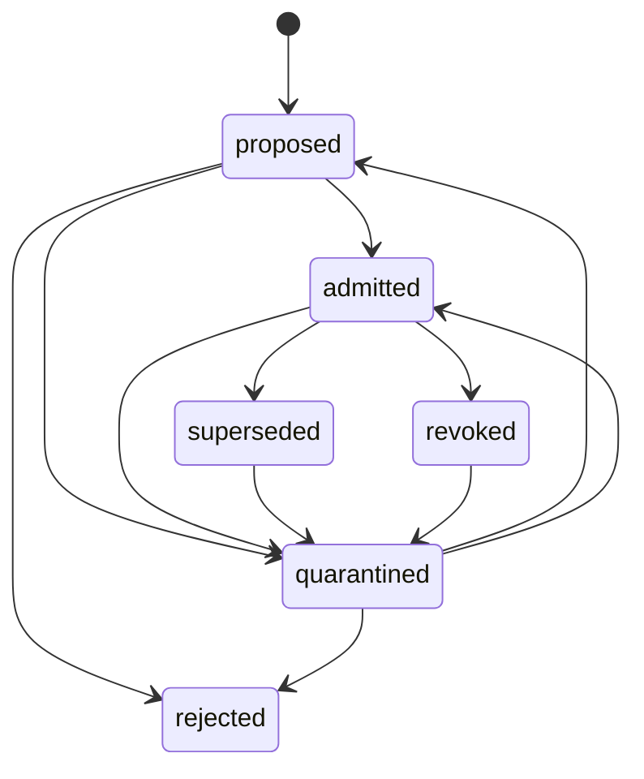

# Memory Quarantine and Toxic-Memory Lifecycle

Status: design only  
Issue: #98  
Authority: Hephaestus Kernel  
Runtime enforcement: not implemented by this document

## 1. Purpose

This document defines a deterministic, auditable lifecycle for durable memory that may be unsupported, contradicted, unsafe to reuse, or no longer valid. It deliberately separates:

- observed persisted facts;
- deterministic Kernel evaluation;
- recommendations;
- authorized state transitions;
- destructive data handling.

"Toxic" is never stored or displayed as an observed fact. It is a cautious interpretation meaning that replaying a memory may create unacceptable decision risk. The canonical persisted state is the lifecycle state and its receipts, not the label.

Hermes and other external agents may submit bounded operational Evidence and claim proposals. They cannot admit, quarantine, release, reject, supersede, revoke, delete, or rewrite durable memory.

## 2. Non-goals

This design does not:

- implement storage, APIs, migrations, UI, or automatic enforcement;
- infer user intent, sensitive traits, truth, or maliciousness;
- delete Evidence, provenance, contradiction records, or transition history;
- let a model assign final lifecycle state;
- retroactively mutate the content of an admitted memory;
- treat confidence, model output, source reputation, or age alone as proof of toxicity.

## 3. Canonical objects

### 3.1 Memory candidate

A candidate is a proposed durable memory before admission.

Required identity:

- `memoryId`: stable Kernel-issued identifier;
- `contentDigest`: digest of normalized immutable content;
- `evidenceIds`: non-empty bounded references to persisted Evidence;
- `claimIds`: bounded references to persisted claim/admission records;
- `createdAt`;
- `proposedBy`: authenticated actor identity and actor type.

### 3.2 Lifecycle record

The lifecycle record is append-only in meaning. Current state is a projection of valid transition receipts.

```ts
type MemoryLifecycleState =
  | 'proposed'
  | 'quarantined'
  | 'admitted'
  | 'rejected'
  | 'superseded'
  | 'revoked';

type MemoryLifecycleReasonCode =
  | 'awaiting_validation'
  | 'insufficient_evidence'
  | 'unresolved_contradiction'
  | 'source_integrity_risk'
  | 'provenance_gap'
  | 'policy_violation'
  | 'validation_passed'
  | 'human_approved'
  | 'human_rejected'
  | 'replacement_admitted'
  | 'evidence_invalidated'
  | 'admission_error'
  | 'legal_or_safety_hold'
  | 'operator_recovery';

interface MemoryTransitionReceipt {
  receiptId: string;
  memoryId: string;
  from: MemoryLifecycleState;
  to: MemoryLifecycleState;
  reasonCode: MemoryLifecycleReasonCode;
  reason: string;
  actor: { id: string; type: 'kernel' | 'human' | 'founder' | 'recovery' };
  evidenceIds: string[];
  contradictionDecisionIds: string[];
  admissionRecordIds: string[];
  supersedingMemoryId?: string;
  requestId: string;
  expectedRevision: number;
  resultingRevision: number;
  occurredAt: string;
  reversibleBy: MemoryLifecycleState[];
  integrityDigest: string;
}
```

Free-text `reason` is bounded and sanitized. It explains the code but never replaces structured references.

### 3.3 Quarantine recommendation

A recommendation is not a transition and grants no authority.

```ts
interface MemoryQuarantineRecommendation {
  recommendationId: string;
  memoryId: string;
  lifecycleRevision: number;
  signals: QuarantineSignal[];
  recommendedAt: string;
  evaluatorVersion: string;
  status: 'pending' | 'accepted' | 'dismissed' | 'stale';
}
```

A recommendation becomes stale when the memory revision or referenced Evidence changes. Model-generated text may be retained only as explicitly uncertain supporting analysis; deterministic signals and persisted references remain mandatory.

## 4. State semantics

| State | Meaning | Reusable by reasoning? |
|---|---|---:|
| `proposed` | Candidate exists but has not passed durable admission. | No |
| `quarantined` | Reuse is suspended pending review because bounded risk signals exist. | No |
| `admitted` | Kernel admission gates passed and the memory may be reused. | Yes |
| `rejected` | Candidate was denied admission. Evidence and history remain. | No |
| `superseded` | A newer admitted memory explicitly replaces this one. | No |
| `revoked` | A previously admitted memory lost reuse authority. | No |

Quarantine is reversible isolation, not deletion and not a truth judgment. Revocation removes reuse authority but preserves the original content, Evidence, and full audit trail.

## 5. Deterministic transition graph



Every transition requires optimistic revision matching, an idempotency key, actor authorization, required references, and an append-only receipt.

### 5.1 Valid transitions and gates

| From → to | Minimum gate | Approval |
|---|---|---|
| proposed → quarantined | One persisted quarantine signal | Kernel may isolate automatically; human review must be queued |
| proposed → admitted | Existing admission record, valid Evidence, resolved contradictions | Kernel admission policy; human approval where current policy requires it |
| proposed → rejected | Failed admission gate with reason and references | Human for judgment calls; Kernel only for deterministic schema/policy failure |
| quarantined → proposed | Original signal resolved or invalidated | Human |
| quarantined → admitted | Admission gates pass after review | Human; founder if high-impact policy marks it required |
| quarantined → rejected | Review concludes candidate must not be admitted | Human |
| admitted → quarantined | New persisted risk signal | Kernel may suspend reuse automatically; no content mutation |
| admitted → superseded | Replacement memory is already admitted and explicitly linked | Human |
| admitted → revoked | Invalidated Evidence, admission error, policy breach, or explicit legal/safety hold | Human; founder for permanent high-impact revocation |
| superseded → quarantined | Replacement link is corrupt/disputed or recovery is required | Human/recovery actor |
| revoked → quarantined | Revocation is disputed and a controlled review is opened | Founder or recovery actor |

### 5.2 Invalid transitions

All transitions not listed above are invalid, including:

- rejected → admitted/proposed/quarantined;
- superseded → admitted/proposed/revoked;
- revoked → admitted/proposed/superseded;
- proposed → superseded/revoked;
- quarantined → superseded/revoked;
- any state → the same state as a new transition.

A repeated request with the same `requestId` and identical normalized payload returns the original receipt. Reusing the same `requestId` with different content is a conflict.

Rejected, superseded, and revoked records are terminal for direct reuse. Reconsideration creates a new candidate linked to the prior record; it never rewrites terminal history. The only exception is the explicit terminal-to-quarantine recovery path above, which opens investigation but still does not restore reuse authority.

## 6. Quarantine signals

A Kernel recommendation may be produced only from persisted, inspectable signals:

1. **Unresolved contradiction**: a contradiction decision explicitly references the memory's claims and remains unresolved.
2. **Evidence invalidation**: one or more required Evidence records were invalidated, revoked, or failed integrity verification.
3. **Provenance gap**: a required Evidence or admission reference cannot be resolved during reconciliation.
4. **Source-integrity risk**: persisted fetch/security validation records show a source boundary violation, credential-bearing URL, private/local address, or integrity mismatch.
5. **Admission inconsistency**: the current admission record conflicts with the memory digest, required gates, or stored revision.
6. **Policy violation**: a versioned deterministic policy flags prohibited durable content or unauthorized authority fields.
7. **Supersession conflict**: multiple active memories claim to supersede the same record incompatibly.

Signals must contain a type, severity from a bounded enum, persisted reference IDs, evaluator version, and timestamp. They may recommend quarantine; they cannot recommend deletion.

The following alone are insufficient:

- low model confidence;
- source age;
- a model or Hermes assertion;
- popularity or reputation score;
- user dwell time or implicit behavior;
- absence of corroboration unless corroboration was an explicit admission requirement.

## 7. Authority and approval matrix

| Action | Hermes/external agent | Kernel | Human operator | Founder |
|---|---:|---:|---:|---:|
| Propose Evidence/claim | Bounded | Yes | Yes | Yes |
| Recommend quarantine | No final authority | Deterministic only | Yes | Yes |
| Suspend reuse into quarantine | No | Yes, when a persisted signal matches policy | Yes | Yes |
| Admit/release from quarantine | No | Executes approved policy | Required | Required when high-impact |
| Reject candidate | No | Deterministic hard failure only | Required otherwise | Yes |
| Supersede admitted memory | No | Validates and records | Required | Yes |
| Revoke admitted memory | No | May emergency-quarantine, not silently revoke | Required | Required for permanent/high-impact cases |
| Delete content/history | No | No autonomous authority | Request only | Explicit founder approval plus retention/legal checks |

Deletion is outside the lifecycle states. If ever implemented, it must be a separate destructive workflow with preview, exact targets, retention constraints, recovery/export plan, two-step approval, and a tombstone receipt. Evidence and audit receipts should normally be retained even when content must be redacted.

## 8. Reversibility and recovery

- **Quarantine**: restore through a new reviewed transition to `proposed` or `admitted`; never erase the quarantine receipt.
- **Rejection**: create a new linked candidate after new Evidence; do not reopen the rejected record.
- **Supersession**: if the replacement becomes unsafe, quarantine the replacement and the superseded record for review. Do not silently reactivate the old memory.
- **Revocation**: open a new candidate or use `revoked → quarantined` for controlled dispute/recovery. Restoration requires a new admission receipt and, if implemented later, should produce a new memory identity or explicit generation.
- **Corrupt projection**: rebuild current state solely from validated receipts. If receipts conflict or a digest fails, fail closed to non-reusable quarantine in a recovery projection without fabricating a normal lifecycle receipt.
- **Missing dependency**: mark startup reconciliation blocked, exclude the memory from reuse, and expose exact missing reference IDs through sanitized diagnostics.

No recovery path may discard Evidence, provenance, or earlier receipts.

## 9. Startup reconciliation

Before memory reuse is enabled, the Kernel should eventually verify:

1. one immutable memory payload matches its content digest;
2. transition receipts form one continuous revision chain;
3. every `from` matches the prior projected state;
4. all Evidence, contradiction, admission, and supersession references resolve;
5. terminal records are excluded from active-memory indexes;
6. quarantined records cannot enter reasoning retrieval;
7. supersession links are acyclic and point to an admitted replacement;
8. duplicate request IDs have identical normalized payloads.

Failures are classified:

- **recoverable index drift**: rebuild projections from receipts;
- **missing reference**: block reuse and require review;
- **receipt corruption/digest mismatch**: fail closed, preserve bytes, require recovery authority;
- **ambiguous chain/fork**: block reuse; never choose a branch by timestamp alone.

Startup reconciliation must not emit ordinary lifecycle transitions merely because storage is corrupt. Recovery actions receive separate recovery receipts.

## 10. Replay Lab projection

Replay Lab must display three distinct layers:

### Observed record

- current projected lifecycle state;
- exact transition receipts;
- referenced Evidence and decisions;
- actor, timestamp, reason code, and revision;
- integrity/reconciliation status.

### Deterministic interpretation

- which versioned rule matched;
- which persisted references satisfied the rule;
- whether a recommendation is current or stale;
- why reuse is allowed or blocked.

### Human decision

- approval or rejection;
- bounded rationale;
- identity and time;
- whether founder approval was required and obtained.

Safe language:

- "Reuse suspended after unresolved contradiction signal."
- "Kernel recommends quarantine; human review pending."
- "Evidence reference is missing; reuse blocked during reconciliation."

Forbidden language without direct persisted proof:

- "This memory is false."
- "Hermes poisoned the memory."
- "The model intended to mislead."
- "The source is malicious."

## 11. Compatibility with existing records

The lifecycle layer is additive:

- existing knowledge-admission records remain the prerequisite proof for `admitted`;
- contradiction decisions supply references, not direct mutation authority;
- Prevention proposals remain read-only and cannot transition memory;
- existing receipts remain immutable and may be referenced from lifecycle receipts;
- Replay Lab derives lifecycle views from explicit links only;
- Hermes ingestion continues to reject Kernel-owned authority fields.

An existing admitted memory without a lifecycle record requires a migration plan before enforcement. The safe migration design is to create a Kernel-authored genesis receipt linked to the original admission record, never to infer or rewrite historic transitions. That migration is a separate reviewed issue.

## 12. Failure handling

- Stale `expectedRevision`: return conflict; do not append.
- Duplicate identical `requestId`: return original receipt.
- Duplicate altered `requestId`: reject as idempotency conflict.
- Missing actor authority: reject and record a bounded security event, not a lifecycle transition.
- Invalid transition: reject with current state and allowed next states.
- Partial write: no projected state change unless receipt append and durability barrier succeed.
- Projection write failure after durable receipt: rebuild projection; do not append a compensating lifecycle transition.
- Notification/UI failure: lifecycle state remains authoritative and is replayable.
- Clock anomaly: preserve monotonic receipt order by revision; timestamps are descriptive, not ordering authority.

## 13. Smallest follow-up implementation issues

1. **Lifecycle types and pure transition validator**  
   Add the enums, transition table, authorization checks, and exhaustive unit tests. No persistence.

2. **Append-only repository and idempotent receipts**  
   Persist lifecycle records with optimistic revisions, request binding, corruption detection, and defensive copies.

3. **Quarantine signal evaluator**  
   Derive recommendations only from existing Evidence, contradiction, admission, policy, and integrity records.

4. **Startup reconciliation and retrieval gate**  
   Fail closed, rebuild projections, and exclude non-admitted memory from reasoning retrieval.

5. **Authenticated local API and Replay Lab read model**  
   Expose observed facts, deterministic interpretation, approvals, and safe operator actions.

6. **Legacy admitted-memory migration**  
   Produce reviewed genesis receipts linked to existing admission records with dry-run and rollback evidence.

7. **Destructive retention workflow, if legally required**  
   Design separately with founder approval, exact-target preview, tombstones, and recovery/export constraints.

Each issue must preserve the rule that external agents propose Evidence while the Kernel owns all durable-memory authority.
